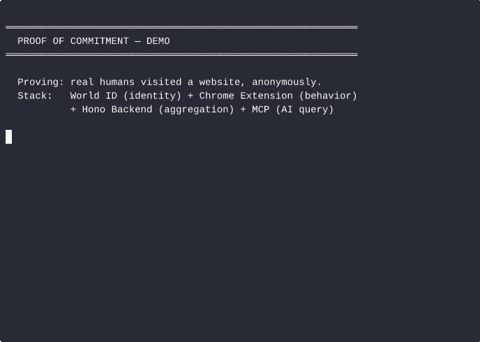

# Proof of Commitment

> **Content is free to fake. Commitment is not.**

A browser extension that captures verifiable behavioral data — proof that real people spend real time at real businesses. Anonymous, cryptographically verified, AI-queryable.

## The Problem

Reviews are fake. Ratings are gamed. Any content-based signal can be manufactured at scale.

But commitment cannot be faked cheaply. A person who visits the same restaurant 12 times in 30 days is a real signal — harder to fake than a thousand five-star reviews.

**Proof of Commitment replaces opinion with behavior.**

## Demo



*World ID identity → commitment submission → aggregated stats → MCP tool output*

## Architecture

```
Browser Extension (Chrome Manifest V3)
  ├── World ID login      — proof of unique person (1 human = 1 account)
  ├── Passive tracking    — domain visits + time (stored locally first)
  └── Anonymous submit    — behavioral signals sent without linking identity

Backend (Cloudflare Workers + D1)
  ├── POST /api/commit    — receive anonymized behavioral data
  └── GET  /api/domain/:domain — return aggregate: unique visitors, repeat rate, avg time

MCP Server
  └── query_commitment({ domain }) — AI agents can ask "how many real humans visit X?"
```

No user IDs stored. No surveillance. Signal without identity.

## What gets proven

When a user submits a commitment, the backend stores:
- `domain`: the website visited
- `visitCount`: number of visits in the window
- `totalSeconds`: total time spent
- `firstSeen` / `lastSeen`: timestamps

What it does **not** store: user IDs, World ID sub values, IP addresses, browsing history, or any cross-domain linkage.

The result: **"6 verified unique visitors, 47 total visits, 87% repeat rate"** — a trust signal that's structurally harder to fake than any review.

## Quick Start

```bash
# Install dependencies
bun install

# Run the E2E test (verifies the full flow with mock World ID)
bun run test:e2e
```

The E2E test proves the architecture without external dependencies:

1. **Mock World ID** — starts a local OIDC provider that issues signed JWTs (RSA-256)
2. **Identity verification** — creates 5 verified unique persons, verifies JWT signatures
3. **Behavioral simulation** — simulates browsing patterns across domains
4. **Commitment submission** — posts anonymized data to the backend
5. **Aggregation query** — queries per-domain stats via REST API
6. **MCP tool** — same query surface available to AI models
7. **Architecture check** — confirms anonymity properties hold

All 7 steps should pass. The only missing piece for production is a real World ID `app_id`.

## Running the demo

```bash
# Run the demo script (used to generate demo.gif)
bash demo.sh

# Or use asciinema to record it yourself
asciinema rec --command "bash demo.sh" demo.cast
```

## MCP Integration

### Remote MCP Server (recommended — zero install)

Add to your MCP config (`~/.claude/claude_desktop_config.json` or Cursor settings):

```json
{
  "mcpServers": {
    "proof-of-commitment": {
      "type": "streamable-http",
      "url": "https://poc-backend.amdal-dev.workers.dev/mcp"
    }
  }
}
```

No installation needed. Works with Claude Desktop, Cursor, Windsurf, and any MCP-compatible AI tool.

### Local MCP Server (stdio)

```json
{
  "mcpServers": {
    "proof-of-commitment": {
      "command": "bun",
      "args": ["run", "/path/to/proof-of-commitment/src/mcp/server.ts"],
      "env": {
        "BACKEND_URL": "https://poc-backend.amdal-dev.workers.dev"
      }
    }
  }
}
```

### Available Tools

| Tool | Description |
|------|-------------|
| `query_commitment` | Query behavioral commitment data for any domain |
| `lookup_business` | Search Norwegian businesses by name, get commitment profile |
| `lookup_business_by_org` | Look up business by org number (9 digits) |
| `lookup_github_repo` | Get behavioral commitment score for any GitHub repo |

Then ask your AI:
> "How trustworthy is Equinor?"
> "What's the commitment score for vercel/next.js?"
> "Is this GitHub repo actively maintained? vercel/ai"

```
EQUINOR ASA (923609016)
Operating for 53.5 years (founded 1972-09-18)
21,408 employees
Revenue: 72,543M NOK
Equity ratio: 37.6%

Commitment signals:
  Temporal (longevity): 95/100
  Financial (health): 90/100
  Operational (activity): 95/100
  Overall commitment: 93/100
```

Data sourced from Norwegian government registers (Brønnøysund) — verified, public, unfakeable.

## Deployment

```bash
# Deploy backend to Cloudflare Workers
bun run deploy

# Backend URL: https://poc-backend.amdal-dev.workers.dev
```

## Production Blocker

The Chrome extension requires a real World ID `app_id`:

1. Go to [developer.worldcoin.org](https://developer.worldcoin.org)
2. Create an app → get `app_id`
3. Set redirect URI to `chrome.identity.getRedirectURL('/callback')`
4. Replace `app_PLACEHOLDER` in `src/extension/auth.ts`

Until then, the extension tracks domain visits without identity verification. The E2E test uses a mock World ID that proves the architecture works.

## Stack

| Layer | Technology |
|-------|-----------|
| Identity | World ID (OIDC, RSA-256 JWTs) |
| Browser | Chrome Manifest V3 extension |
| Backend | Hono + Bun (dev), Cloudflare Workers + D1 (prod) |
| AI interface | MCP (Model Context Protocol) |
| Smart contracts | Solidity (Foundry), Base L2, USDC |
| ZK (future) | Reclaim Protocol (zkTLS), Semaphore V4 |

## Smart Contracts

Layer 2 of the commitment graph: staked endorsements. Users stake USDC on domain recommendations, resolved by behavioral data.

```
contracts/
  src/StakedEndorsement.sol    — Core contract (stake, resolve, claim)
  test/StakedEndorsement.t.sol — 27 tests including fuzz
  script/Deploy.s.sol          — Base Sepolia / mainnet deploy script
```

### Core flow

1. `stake(domain, amount)` — Endorse a business by staking USDC
2. `resolve(domain, positive)` — Oracle resolves outcome (MVP: owner/multisig)
3. `claim(endorsementId)` — Winners get stake back minus 1.5% protocol fee; losers forfeit

### Development

```bash
cd contracts
forge build    # compile
forge test     # run tests
```

### Deploy

```bash
export PRIVATE_KEY=<your-key>
export BASE_SEPOLIA_RPC_URL=<rpc-url>
forge script script/Deploy.s.sol --rpc-url base_sepolia --broadcast --verify
```

USDC addresses: Base Sepolia `0x036CbD53842c5426634e7929541eC2318f3dCF7e`, Base mainnet `0x833589fCD6eDb6E08f4c7C32D4f71b54bdA02913`.

## Roadmap

- [x] Backend aggregation (CF Workers + D1)
- [x] E2E test with mock World ID
- [x] MCP server
- [x] Staked endorsement smart contract (Base L2, USDC)
- [ ] Deploy to Base Sepolia testnet
- [ ] Real World ID `app_id` (needs browser registration)
- [ ] Chrome extension packaging
- [ ] zkTLS proofs for purchase verification (Reclaim Protocol)
- [ ] Unlinkable submissions via Semaphore V4
- [ ] UMA Optimistic Oracle integration for dispute resolution
- [ ] Reputation tracking (BondRegistry)
